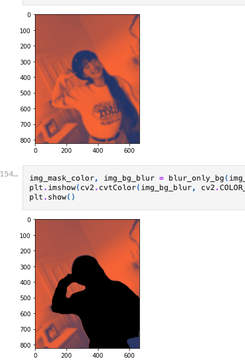
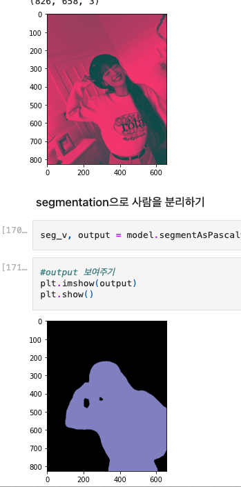
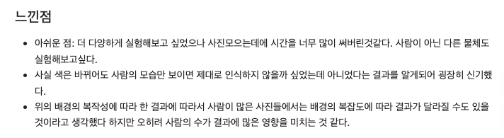

🔑 **PRT(Peer Review Template)**
리뷰어 : 김성연

- [o]  **1. 주어진 문제를 해결하는 완성된 코드가 제출되었나요? (완성도)**
   
   - 색을 바꾸면서 더 잘 segmentation이 되는 것을 볼 수 있었습니다.

- [o]  **2. 프로젝트에서 핵심적인 부분에 대한 설명이 주석(닥스트링) 및 마크다운 형태로 잘 기록되어있나요? (설명)**
    
    - 실험을 하신 의도나 생각들이 잘 정리되었습니다

- [o]  **3. 체크리스트에 해당하는 항목들을 모두 수행하였나요? (문제 해결)**
    - 다양한 관점에서 실험을 해본 것이 인상깊었습니다
    - 같은 사진을 컬러가 달라짐에 따라 Segmentation 인식이 잘되고 안되는 인사이트를 많이 얻어갈 수 있었습니다.
    

- [o]  **4. 프로젝트에 대한 회고가 상세히 기록 되어 있나요? (회고, 정리)**
    - [o]  배운 점
    - [o]  아쉬운 점
    - [o]  느낀 점
    - [o]  어려웠던 점
    

- 저랑 다른 관점에서 실험을 많이 진행하신것 같아서 배워갈 점이 많았습니다
- 저도 몇개 인식이 잘 안되는 문제점들을 밝기나 색을 조정하면서 차이가 있는지 확인해봤으면 좋았을것 같네요.
- 정말 많은 아이디어를 얻어 갈 수 있었습니다!